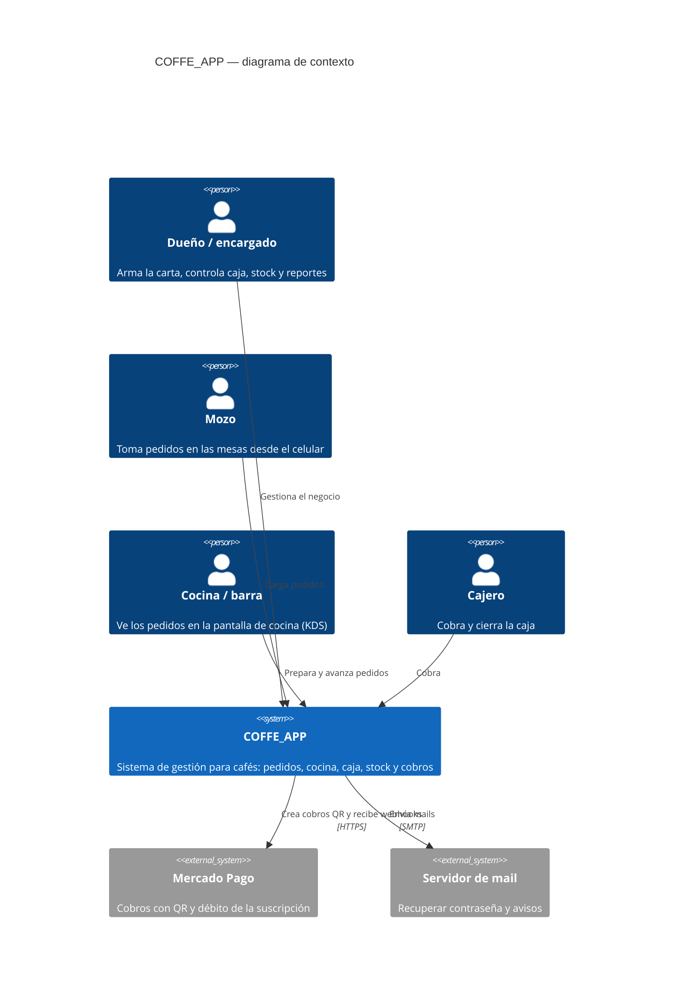

# C4 · Nivel 1 — Contexto

Generado por la skill `arquitecto-c4` desde el commit `3c4df30`.

```mermaid
C4Context
  title COFFE_APP — diagrama de contexto
  Person(dueno, "Dueño / encargado", "Arma la carta, controla caja, stock y reportes")
  Person(mozo, "Mozo", "Toma pedidos en las mesas desde el celular")
  Person(cocina, "Cocina / barra", "Ve los pedidos en la pantalla de cocina (KDS)")
  Person(cajero, "Cajero", "Cobra y cierra la caja")
  System(coffe, "COFFE_APP", "Sistema de gestión para cafés: pedidos, cocina, caja, stock y cobros")
  System_Ext(mp, "Mercado Pago", "Cobros con QR y débito de la suscripción")
  System_Ext(smtp, "Servidor de mail", "Recuperar contraseña y avisos")
  Rel(dueno, coffe, "Gestiona el negocio")
  Rel(mozo, coffe, "Carga pedidos")
  Rel(cocina, coffe, "Prepara y avanza pedidos")
  Rel(cajero, coffe, "Cobra")
  Rel(coffe, mp, "Crea cobros QR y recibe webhooks", "HTTPS")
  Rel(coffe, smtp, "Envía mails", "SMTP")
```
