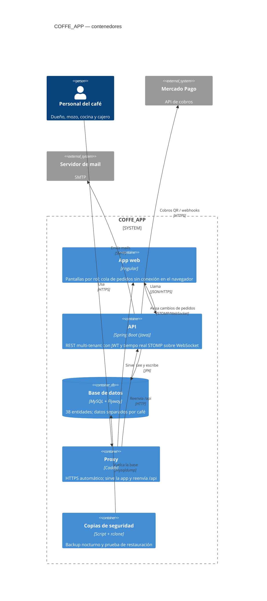

# C4 · Nivel 2 — Contenedores

Generado por la skill `arquitecto-c4` desde el commit `13d042b`.

```mermaid
C4Container
  title COFFE_APP — contenedores
  Person(usuario, "Personal del café", "Dueño, mozo, cocina y cajero")
  System_Boundary(sistema, "COFFE_APP") {
    Container(spa, "App web", "Angular", "Pantallas por rol; cola de pedidos sin conexión en el navegador")
    Container(api, "API", "Spring Boot (Java)", "REST multi-tenant con JWT y tiempo real STOMP sobre WebSocket")
    ContainerDb(db, "Base de datos", "MySQL + Flyway", "38 entidades; datos separados por café")
    Container(proxy, "Proxy", "Caddy", "HTTPS automático; sirve la app y reenvía /api")
    Container(backup, "Copias de seguridad", "Script + rclone", "Backup nocturno y prueba de restauración")
  }
  System_Ext(mp, "Mercado Pago", "API de cobros")
  System_Ext(smtp, "Servidor de mail", "SMTP")
  Rel(usuario, proxy, "Usa", "HTTPS")
  Rel(proxy, spa, "Sirve")
  Rel(proxy, api, "Reenvía /api", "HTTP")
  Rel(spa, api, "Llama", "JSON/HTTPS")
  Rel(api, spa, "Avisa cambios de pedidos", "STOMP/WebSocket")
  UpdateRelStyle(spa, api, $offsetY="-40")
  UpdateRelStyle(api, spa, $offsetY="30")
  Rel(api, db, "Lee y escribe", "JPA")
  Rel(api, mp, "Cobros QR / webhooks", "HTTPS")
  Rel(api, smtp, "Envía mails", "SMTP")
  Rel(backup, db, "Vuelca la base", "mysqldump")
```
